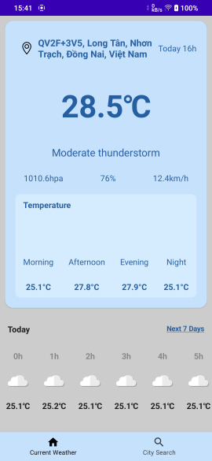
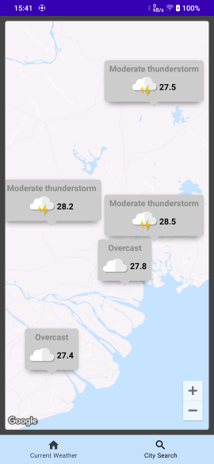

# WeatherVisualizer_MVI
a weather app that using MVI pattern and clean architecture 

## About
### 1, Tech Stack
-	Kotlin language
-	Jetpack Compose UI
-	MVI pattern with clean architecture
-   Google Map Api
-	Koin DI
-	Kotlin Coroutine Flows
-	Ktor, Kotlin Serialization
-   SQLDelight

### 2, Features
-	Show current weather condition
-	Add Locations to see the weathers
-	Display multiple weather markers on the map
-	Dislay weather conditions in the next 7 days

## Demo 

https://user-images.githubusercontent.com/85553681/199931419-276559ae-07ba-4a09-bffd-e4755a3a9d7f.mp4

## Screenshots

|                                       |                                    |                          
| :-----------------------------------: | :--------------------------------: | 
|   |    | 

## References

Inspired by this design:
https://dribbble.com/shots/17998271-Cuacane-Weather-App

Inspired by this project:
https://www.youtube.com/watch?v=eAbKK7JNxCE